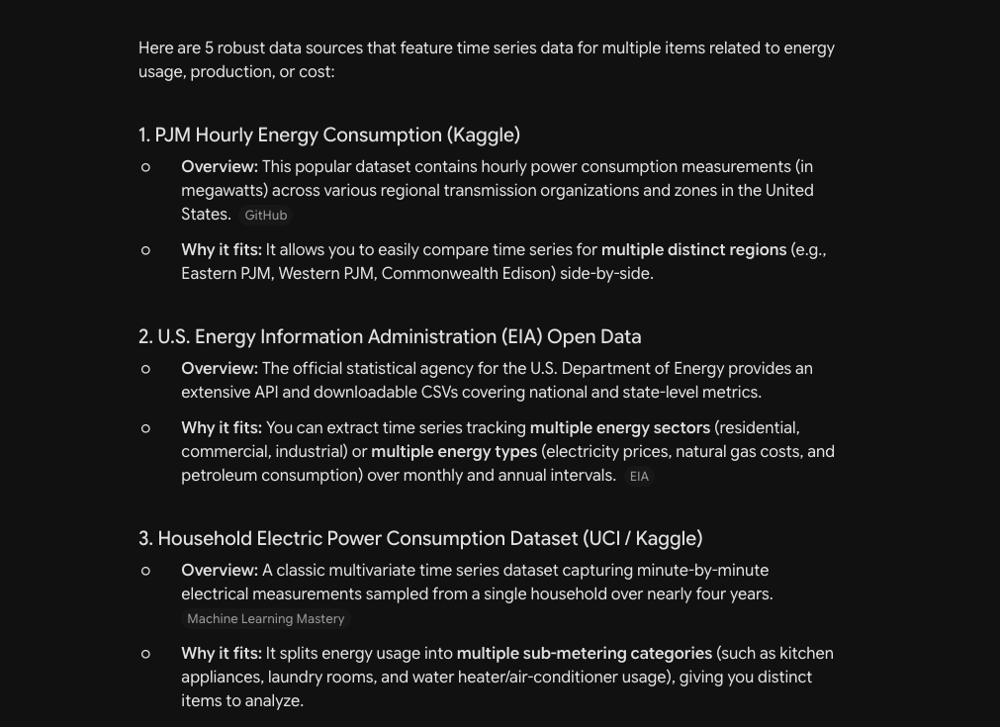
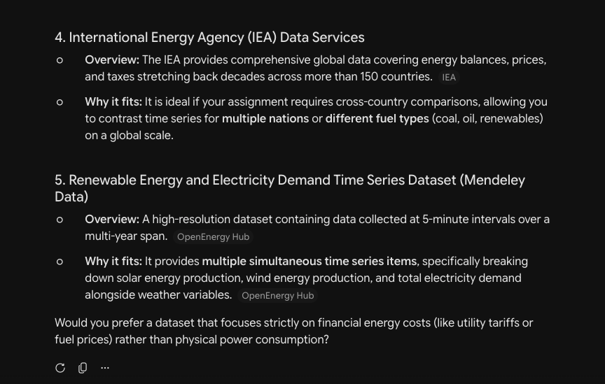

## Introduction

For this assignment, I will be analyzing electricity sales from commercial customers. This category is where data centers are listed under by the U.S. Energy Information Administration (EIA). I will find the trend in electricity consumption from 2015 to current, and see if there as been a significant increase that coincides with the rise of data centers.

## Approach

I used Gemini to recommend a data source for me to use. This is the prompt I used:

"I am working on an assignment that requires a data source with time series for 2 or more separate items. I am particularly interested in a data source that is related to energy usage or cost. Please list 5 data sources I could particularly use"

This answer is where I found the data set I will be using ([Link to data set source](https://www.eia.gov/opendata/browser/electricity/retail-sales)). I used the EIA API to download the JSON file with the data set I will be using. The JSON file is stored in GitHub I will be reading it into R using the jsonlite package.

I will be using different window functions throughout the assignment to answer varies business questions. I will be implementing the window functions in SQL and in Dplyr to get more practice in both. As well, I will practice different visualizations in ggplot2 and use Github throughout the assignment.
